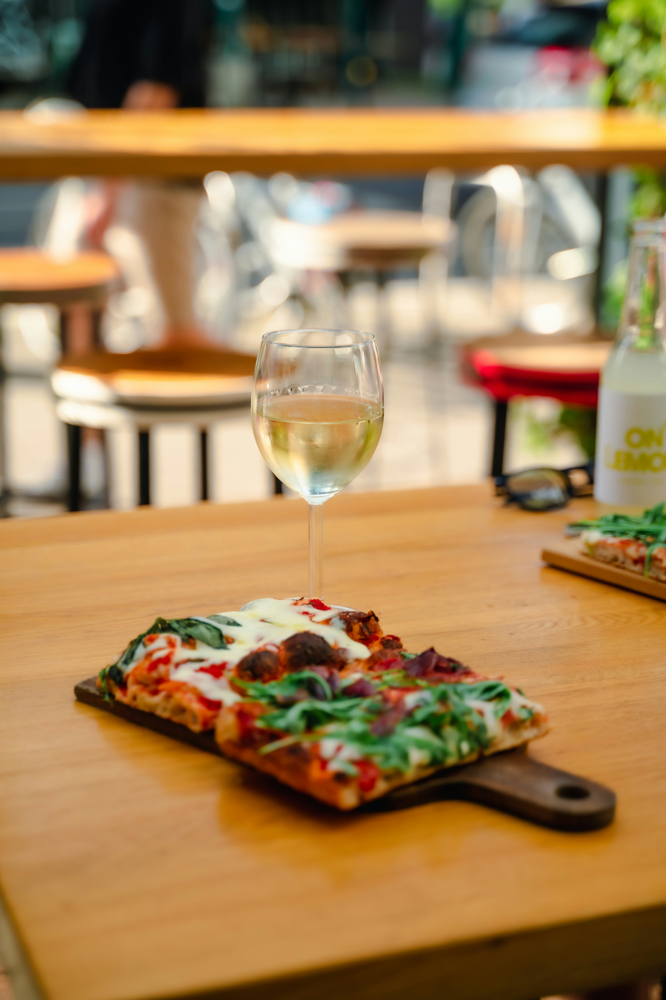

# Menu

## Pizze klasyczne

|Lp.|Pizza:                                                                                      |rozmiar: | 30 cm     | 50 cm        | 60 cm  |
|---|--------------------------------------------------------------------------------------------|---------|-----------|--------------|--------|
|1. |MARGHERITA (sos pomidorowy, ser, oregano)                                                   |         |20 zł      | 40 zł        | 50 zł  |
|2. |FUNGHI (sos pomidorowy, ser, pieczarki)                                                     |         |22 zł      | 42 zł        | 52 zł  |
|3. |SALAMI (sos pomidorowy, ser, mozarella, salami)                                             |         |23 zł      | 43 zł        | 53 zł  |
|4. |VESUVIO (sos pomidorowy, podwójny ser, szynka)                                              |         |24 zł      | 44 zł        | 54 zł  |
|5. |MILANO (sos pomidorowy, ser, szynka, papryka, oregano)                                      |         |26 zł      | 46 zł        | 56 zł  |
|6. |BECONO (sos pomidorowy, ser mozarella, boczek, cebula, czosnek)                             |         |27 zł      | 47 zł        | 57 zł  |
|7. |BIANCO (sos śmietanowy, ser mozarella, boczek, cebula)                                      |         |29 zł      | 49 zł        | 59 zł  |
|8. |DI POLLO (sos pomidorowy, ser mozarella, kurczak, kukurydza, papryka)                       |         |30 zł      | 45 zł        | 55 zł  |
|9. |BOLOGNA (sos pomidorowy, ser mozarella, pesto pistacjowe, mortadela bologna, parmezan)      |         |37 zł      | 49 zł        | 59 zł  |
|10. |4 SERY (sos pomidorowy, mozarella, gorgonzola, mimolette, parmezan)                        |         |30 zł      | 43 zł        | 53 zł  |

## Pizze wegetariańskie

|Lp.|Pizza:                                                                                      |rozmiar: | 30 cm     | 50 cm        | 60 cm  |
|---|--------------------------------------------------------------------------------------------|---------|-----------|--------------|--------|
|1. |MARGHERITA (sos pomidorowy, ser, oregano)                                                   |         |20 zł      | 40 zł        | 50 zł  |
|2. |FUNGHI (sos pomidorowy, ser, pieczarki)                                                     |         |22 zł      | 42 zł        | 52 zł  |
|3. |SALAMI (sos pomidorowy, ser, mozarella, sałata)                                             |         |23 zł      | 43 zł        | 53 zł  |
|4. |VESUVIO (sos pomidorowy, podwójny ser)                                                      |         |24 zł      | 44 zł        | 54 zł  |
|5. |MILANO (sos pomidorowy, ser, papryka, oregano)                                              |         |26 zł      | 46 zł        | 56 zł  |

## Pinsa 

|Lp.|Nazwa:                                                                                      |rozmiar: | 30 cm | 50 cm    | 60 cm  |
|---|--------------------------------------------------------------------------------------------|---------|-------|----------|--------|
|1. |Cotto (sos pomidorowy, ser mozzarella serek philadelphia, Prosciutto Cotto, oliwa czosnkowa)|         |26 zł  |36 zł     |48 zł   |
|2. |Buratta (sos pomidorowy, ser burrata, pomidorki cherry, świeża bazylia, oregano)            |         |33 zł  |43 zł     |53 zł   |
|3. |Parma (sos pomidorowy, ser mozzarella, ser grana padano, Prosciutto Crudo, oliwa czosnkowa) |         |30 zł  |40 zł     |50 zł   |

## Zupy

|Lp.|Zupa:                                                                                |pojemność: | 350 ml |
|---|-------------------------------------------------------------------------------------|-----------|--------|
|1. |Krem z pomidorów (pomidory, papryka, śmietana, bazylia)                              |           |16 zł   |
|2. |Minestrone (pomidory, cukinia, marchewka, fasolka szparagowa, zielony groszek, seler)|           |19 zł   |
|3. |Toscana (jarmuż, cukinia, ziemniaki, seler, cebula, rigatino, fasolka cannellini)    |           |19 zł   |

## Dodatki

1. Cukinia - 5 zł
2. Karczochy - 6 zł
3. Krewetki - 10 zł

## Napoje

|Lp.|Napój:                                                                                |pojemność: | 330 ml | 500 ml  |
|---|--------------------------------------------------------------------------------------|-----------|--------|---------|
|1. |Woda                                                                                  |           | 5 zł   | 10 zł   |
|2. |Sok pomarańczowy                                                                      |           | 7 zł   | 12 zł   |
|3. |Sok jabłkowy                                                                          |           | 7 zł   | 12 zł   |
|4. |Lemoniada cytrynowa                                                                   |           | 12 zł  | 17 zł   |
|5. |Piwo jasne                                                                            |           | 10 zł  | 15 zł   |
|6. |Piwo ciemnie                                                                          |           | 12 zł  | 17 zł   |
